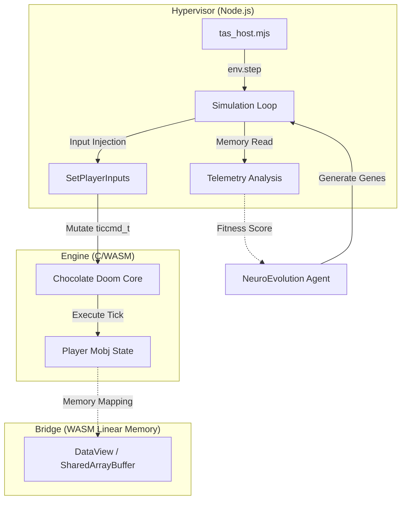

# ARCHITECTURE.md - Doom1-TAS-IA Architecture & C-WASM-JS Bridge

## Overview
This document specifies the zero-overhead C-WASM-JS bridge and execution pipeline for the Doom1-TAS-IA autonomous speedrun bot. The architecture focuses on deterministic execution and high-performance telemetry extraction.

## System Diagram

## Core Layers

### 1. Engine Layer (C/WASM)
- **Core:** Headless compilation of Chocolate Doom/PrBoom core using Emscripten (`emcc`).
- **Hooks:** Intercepts `ticcmd_t` before physical frame processing via `EMSCRIPTEN_KEEPALIVE` hooks.
- **Key Functions:**
    - `_SetPlayerInputs(forward, side, angle, buttons)`: Overrides game inputs for the current tick.
    - `_GetPlayerMobjPointer()`: Returns the address of the player object in WASM memory.

### 2. Bridge & Telemetry Layer (DataView)
Direct memory inspection over the WebAssembly Linear Memory buffer using fixed structure pointer offsets. We use **ILP32** data model (32-bit pointers).

| Attribute | Offset (bytes) | Type | Format |
| :--- | :--- | :--- | :--- |
| `MOBJ_X` | 24 | `int32_t` | Fixed 16.16 |
| `MOBJ_Y` | 28 | `int32_t` | Fixed 16.16 |
| `MOBJ_Z` | 32 | `int32_t` | Fixed 16.16 |
| `MOBJ_ANGLE` | 48 | `uint32_t` | BAM (Binary Angular Measure) |
| `MOBJ_HEALTH` | 112 | `int32_t` | Integer |

### 3. Hypervisor Layer (Node.js / ES Modules)
Decoupled tick-by-tick simulation loop (`env.step()`) executed independently from real-time display constraints.
- **Deterministic:** Every run with the same inputs produces the same results.
- **Async Interop:** Uses Top-Level Await for WASM instantiation.

## Zero-Overhead Principles
- **No Serialization:** Telemetry reads directly from WASM Shared Array / DataView memory pointers without JSON parsing.
- **Atomic Ticks:** Discrete frame stepping ensures deterministic simulation for neural network training and TAS reproduction.
- **Binary Compatibility:** Direct access to C structs from JS via pointer arithmetic.

## Build Pipeline
The project uses a custom toolchain based on Emscripten and CMake:
1.  **Environment:** Requires `emsdk` initialized (`source emsdk_env.sh`).
2.  **Config:** `emcmake cmake -G Ninja ..`
3.  **Compilation:** `ninja` produces `chocolate-doom.js` and `chocolate-doom.wasm`.

