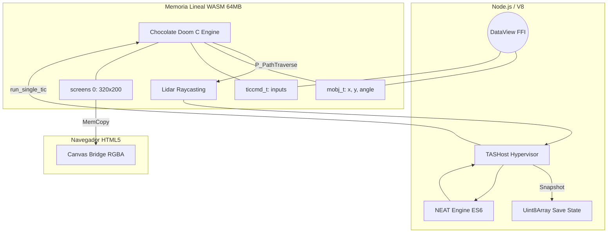

<div align="center">
  <h1>Doom1-TAS-IA</h1>
  <p><strong>La próxima generación de Speedrunning TAS y Reinforcement Learning "Bare Metal" para Doom, corriendo directo en la memoria de WebAssembly.</strong></p>
  <a href="https://buymeacoffee.com/punkito">
    
  </a>
</div>

<br/>

**Doom1-TAS-IA** no es un bot tradicional. A diferencia de ViZDoom o frameworks que dependen de capturar la pantalla por video (Opencv) o enviar comandos por sockets, este proyecto **compila Chocolate Doom a WebAssembly (WASM)** e inyecta algoritmos genéticos mutando **físicamente la RAM** de forma síncrona. 

> Cero dependencias de ML externas. Cero overhead de video. Cero lag de IPC. Solo JavaScript de V8 y la memoria lineal pura.

## Topología del Sistema (Zero-Overhead Architecture)



## Características Clave (El "Mata-DSDA")

* **Motor NEAT Zero-Deps:** Un motor evolutivo (NeuroEvolution of Augmenting Topologies) escrito al 100% en ES6 Vanilla, sin usar TensorFlow ni Python.
* **Control Físico Absoluto:** El agente lee la estructura `mobj_t` y escribe en el `ticcmd_t` usando offsets exactos en la memoria de C vía `DataView`.
* **Lidar Nativo (Raycasting):** Hemos inyectado ganchos en las funciones de intercepción de BSP de Doom (`P_PathTraverse`). La IA dispara láseres para detectar muros directamente desde el motor de colisiones de id Software.
* **Máquina del Tiempo TAS (Rewind en Memoria):** Los _Save States_ se realizan clonando todo el `HEAPU8` de WebAssembly (64MB) en milisegundos, permitiendo un rebobinado cuadro a cuadro impecable.
* **Canvas Bridge (Frontend Web):** Un cliente visual nativo (`js-client/`) lee los índices de color del buffer interno de pantalla y los pinta directo a un HTML5 Canvas mapeando a la paleta `PLAYPAL` de forma asíncrona.

## Roadmap de Evolución

- [x] **Fase 1-7:** Portear Chocolate Doom a WASM y estabilizar memoria asíncrona.
- [x] **Fase 8:** Cálculo de offsets ILP32, inyección de `ticcmd_t` y construcción del hipervisor (Gym-like `tas_host.mjs`).
- [x] **Fase 9:** Ojos para la IA (Lidar), Navegación por Waypoints y Extracción del Framebuffer visual.
- [x] **Fase 10:** Snapshots de Memoria Lineal (`Uint8Array`) para retroceso de frames y Save States asíncronos.
- [ ] **Fase 11:** Exportación dinámica de offsets desde C a JS (Para resolver fragilidad de punteros en memoria).
- [ ] **Fase 12:** Interfaz gráfica empaquetada (Electron/Tauri) para TASing humano e interfaz de entrenamiento.

## Cómo Probar la Magia

Primero, asegúrate de tener el entorno WASM (`emsdk`) activado y un `doom1.wad` local:

```bash
# 1. Compilar los inyectores C a WebAssembly
ninja -C build

# 2. Iniciar la matriz de entrenamiento de la Red Neuronal
npm run train

# 3. Levantar el cliente visual de Canvas (Mira a la IA jugar)
npm run start-client
```

## Fork & Contribución
Este repositorio tiene el potencial de redefinir cómo creamos "Tool-Assisted Speedruns" y enseñamos a inteligencias artificiales a sortear motores de los años 90. 
Si te gusta el bajo nivel, C, WASM o las Redes Neuronales, siéntete libre de FORKEAR el repo y enviar un Pull Request.

[Cómprame un café para mantener vivo el código (BuyMeACoffee)](https://buymeacoffee.com/punkito)
