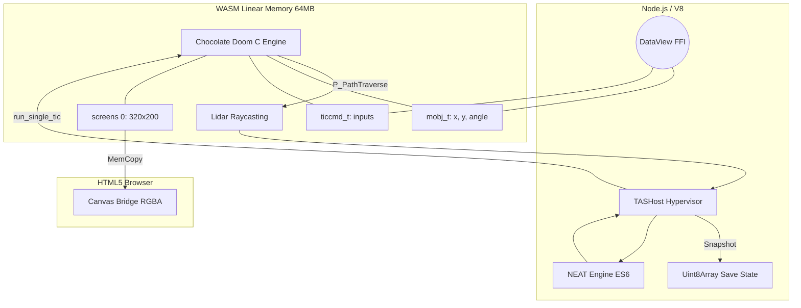

<div align="center">
  <h1>Doom1-TAS-IA</h1>
  <p><strong>The next generation of "Bare Metal" Tool-Assisted Speedrunning and Reinforcement Learning for Doom, running directly in WebAssembly memory.</strong></p>
  <a href="https://buymeacoffee.com/punkito">
    
  </a>
  <br/>
  <a href="README-es.md"><strong>Leer en Español</strong></a>
</div>

<br/>

**Doom1-TAS-IA** is not a traditional bot. Unlike ViZDoom or other frameworks that rely on screen scraping (OpenCV) or socket-based IPC, this project **compiles Chocolate Doom into WebAssembly (WASM)** and injects genetic algorithms by physically mutating the RAM synchronously.

> Zero external ML dependencies. Zero video overhead. Zero IPC lag. Just pure V8 JavaScript and raw linear memory.

## System Topology (Zero-Overhead Architecture)



## Key Features (The DSDA-Killer)

* **Zero-Deps NEAT Engine:** A NeuroEvolution of Augmenting Topologies engine written 100% in Vanilla ES6, ditching TensorFlow and Python entirely.
* **Absolute Physical Control:** The agent reads the `mobj_t` structure and writes to `ticcmd_t` using precise C memory offsets via `DataView`.
* **Native Lidar (Raycasting):** Hooks directly into Doom's BSP line traversal (`P_PathTraverse`). The AI shoots lasers to detect walls directly from id Software's collision engine.
* **TAS Time Machine (Memory Rewind):** _Save States_ are executed by deep-cloning the entire WebAssembly `HEAPU8` (64MB) in milliseconds, allowing pristine frame-by-frame rewinds.
* **Canvas Bridge (Web Frontend):** A native visual client (`js-client/`) reads the internal screen buffer's color indices and paints them directly onto an HTML5 Canvas, mapping to the `PLAYPAL` palette asynchronously.

## Evolution Roadmap

- [x] **Phase 1-7:** Port Chocolate Doom to WASM and stabilize asynchronous memory.
- [x] **Phase 8:** ILP32 offset calculation, `ticcmd_t` injection, and Hypervisor construction (Gym-like `tas_host.mjs`).
- [x] **Phase 9:** Eyes for the AI (Lidar), Waypoint Navigation, and visual Framebuffer Extraction.
- [x] **Phase 10:** Linear Memory Snapshots (`Uint8Array`) for frame-by-frame rewinds and blazing fast Save States.
- [ ] **Phase 11:** Dynamic C-to-JS offset exportation (To solve pointer fragility issues).
- [ ] **Phase 12:** Packaged graphical interface (Electron/Tauri) for human TASing and a unified training dashboard.

## How to run the magic

Ensure you have your WASM environment loaded (`emsdk`) and a local `doom1.wad`:

```bash
# 1. Compile C hooks into WebAssembly
ninja -C build

# 2. Boot up the Neural Network Training Matrix
npm run train

# 3. Spin up the Canvas Visual Client (Watch the AI play)
npm run start-client
```

## Fork & Contribution
This repository has the potential to redefine how we create Tool-Assisted Speedruns and teach artificial intelligence to navigate 90s engines.
If you are a low-level maniac, C, WASM or Neural Network enthusiast, feel free to FORK the repo and drop a Pull Request.

[Buy me a coffee to keep the code alive!](https://buymeacoffee.com/punkito)
